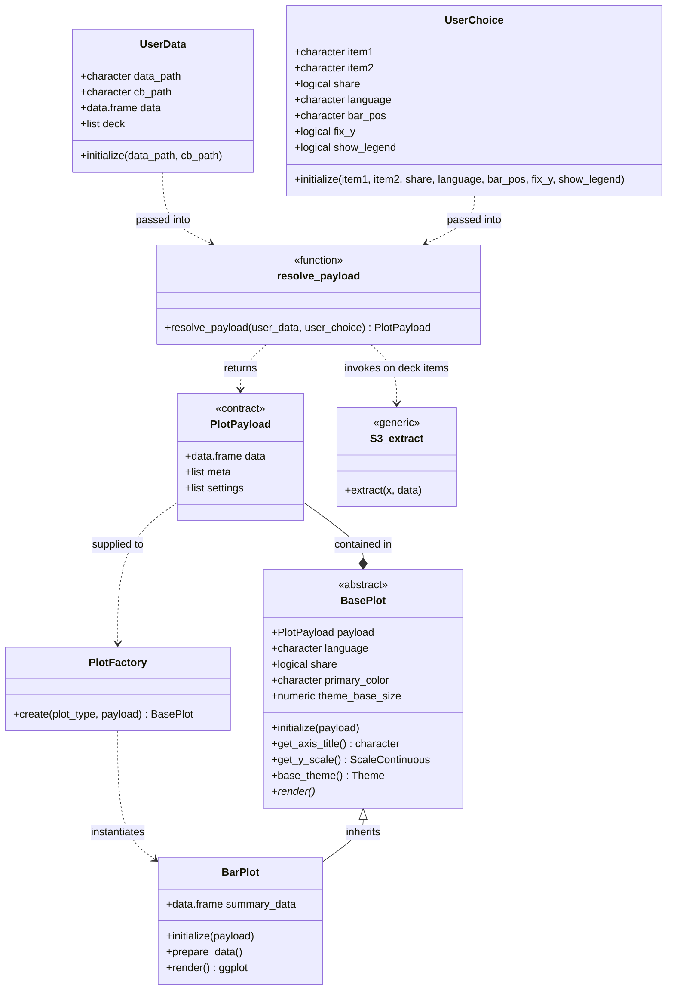

```mermaid
classDiagram
    direction TB

    %% Input Domain
    class UserData {
        +character data_path
        +character cb_path
        +data.frame data
        +list deck
        +initialize(data_path, cb_path)
    }

    class UserChoice {
        +character item1
        +character item2
        +logical share
        +character language
        +character bar_pos
        +logical fix_y
        +logical show_legend
        +initialize(item1, item2, share, language, bar_pos, fix_y, show_legend)
    }

    %% Bridge / Orchestration Layer
    class resolve_payload {
        <<function>>
        +resolve_payload(user_data, user_choice) PlotPayload
    }

    class PlotPayload {
        <<contract>>
        +data.frame data
        +list meta
        +list settings
    }

    class S3_extract {
        <<generic>>
        +extract(x, data)
    }

    %% Creational / Visualization Layer
    class PlotFactory {
        +create(plot_type, payload) BasePlot
    }

    class BasePlot {
        <<abstract>>
        +PlotPayload payload
        +character language
        +logical share
        +character primary_color
        +numeric theme_base_size
        +initialize(payload)
        +get_axis_title() character
        +get_y_scale() ScaleContinuous
        +base_theme() Theme
        +render()*
    }

    class BarPlot {
        +data.frame summary_data
        +initialize(payload)
        +prepare_data()
        +render() ggplot
    }

    %% Relationships & Flow
    UserData ..> resolve_payload : passed into
    UserChoice ..> resolve_payload : passed into
    resolve_payload ..> S3_extract : invokes on deck items
    resolve_payload ..> PlotPayload : returns

    PlotPayload ..> PlotFactory : supplied to
    PlotFactory ..> BarPlot : instantiates

    BasePlot <|-- BarPlot : inherits
    PlotPayload --* BasePlot : contained in
```
